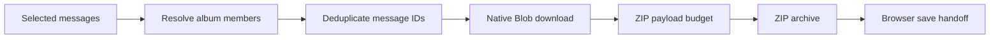
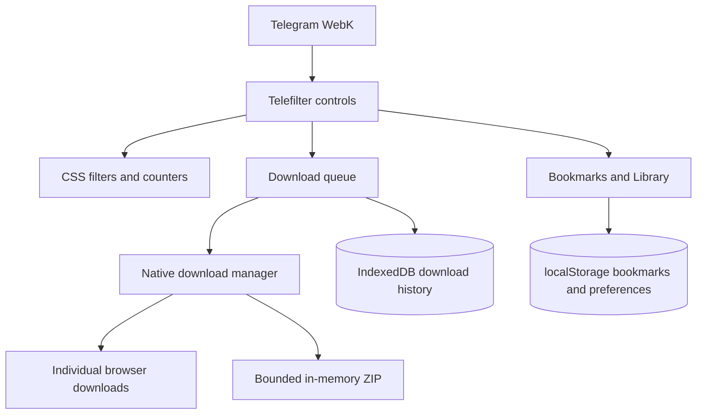

<div align="center">

# 📦 Telefilter Desktop <sub>v5.0.0</sub>

**Media filters, mixed-album ZIP downloads & a local bookmark library for Telegram WebK.**

*Find the media. Keep the album together. Return to the message.*

[](telefilter_desktop.user.js)
[](#installation)


[Features](#features) · [Installation](#installation) · [Workflow](#workflow) · [Limits](#limits) · [Development](#development)

</div>

---

## Features

One userscript, no build step, no external JavaScript libraries.

| Tool | What it does |
| :--- | :--- |
| 🎛️ **Media filters** | Filter message bubbles by category using CSS, with local per-chat preferences. |
| 📦 **Mixed-album ZIP** | Expand grouped posts into their available media members, including photos and videos in the same album. Deduplicate members before bundling. |
| 📥 **Native downloads** | Use Telegram's download manager for individual files and non-ZIP batches. |
| 📝 **File naming & captions** | Optional smart names and caption sidecars. ZIP entries include message IDs and sequence numbers to avoid filename collisions. |
| 🔖 **Bookmark library** | Keep message locators, previews and tags locally; search and jump back to messages. |
| ⚡ **Harvest** | Scroll through history and count newly indexed message IDs, with stop control and elapsed-time progress. |
| 👁️ **Viewer actions** | Download displayed media or bookmark a normal message viewer's target when its locator is available. |
| 🗄️ **Download history** | Record browser handoffs in a local IndexedDB vault for history and repeat-download filtering. |

> [!NOTE]
> These tools depend on Telegram WebK's internal APIs and DOM. They are not an official Telegram integration, and compatibility can change with Telegram updates.

## Installation

1. Install [Tampermonkey](https://www.tampermonkey.net/) or another compatible userscript manager.
2. Open [`telefilter_desktop.user.js`](telefilter_desktop.user.js) while signed into a GitHub account with repository access.
3. Copy its contents into a new userscript in the manager and save.
4. Open or refresh [Telegram WebK](https://web.telegram.org/k/), sign in to Telegram normally, then open a chat.

> [!IMPORTANT]
> This repository is **private**. Anonymous raw installation links and automatic updates are not guaranteed to work. The signed-in copy-and-save route above avoids depending on those links.

### Updating an existing installation

Replace the contents of the existing Telefilter script, save, then refresh Telegram. Do not enable two copies at once.

The canonical filename is now **`telefilter_desktop.user.js`**. Older copies used `telefilter_desktop_v4.user.js` even though their internal version was 5.0.0. The userscript name and namespace remain unchanged in this naming/documentation update to preserve installation identity. Storage keys are unchanged as well.

## Workflow

### Bundle a mixed album

1. Open the album in a chat and select its message with Telegram's native selection controls.
2. Turn **ZIP** on, then use the Telefilter download action.
3. Telefilter resolves grouped album members from Telegram's message store, removes duplicates, retrieves media bytes and builds the archive.
4. Save the archive through the browser and check its contents.



For a post containing **3 videos + 2 photos**, the expected result is **5 media files**, plus any enabled caption sidecars. ZIP mode expands albums even when an input message represents just one member.

### Find and revisit media

| Action | Result |
| :--- | :--- |
| Choose a media filter | Show matching categories in the current chat. |
| Run Harvest | Index additional history as Telegram renders it; stop when enough has been found. |
| Bookmark a message | Store its peer/message locator locally. |
| Add tags in Library | Organize saved items without changing Telegram messages. |
| Use Library search | Search text or qualifiers such as `tag:work`, `type:photo`, `chat:"Team"` and `mid:123`. |
| Jump to a bookmark | Ask Telegram to navigate to the stored message and topic. |

## Architecture



**Keep the small parts small:** vanilla JavaScript, CSS filtering, bounded indexes and native Telegram downloads. No npm installation or bundled framework is required.

## Limits

| Area | Current boundary |
| :--- | :--- |
| **ZIP size** | Up to **128 MiB of collected payload**, including captions. This is **not** a cap on total tab memory. |
| **Large or unknown-size media** | ZIP stops rather than falling back to a different download mode silently. Use a smaller batch or native downloads. |
| **Album completeness** | Membership comes from Telegram's available message store. Invalid or unavailable results stop the job; the script cannot independently prove that the server has no additional members. |
| **Save status** | A browser handoff does **not** prove that the file finished writing to disk. |
| **Harvest** | Limited by rendered history, inactivity detection and a two-minute run ceiling. It is not a full server-history export. |
| **Viewer downloads** | The separate viewer action fetches displayed media; it does not guarantee original-quality media or a complete album. |
| **Viewer bookmarks** | Avatar, local and scheduled viewers are not treated as normal message locators. Use the message menu when a locator is unavailable. |
| **Local data** | Clearing Telegram site storage can remove the local library and history. Export bookmarks before clearing it. |

Use downloads only for content you are authorized to save. Telegram account access and content availability remain subject to Telegram's behavior and the source chat.

## Development

### Repository layout

```text
telefilter_desktop.user.js              Main userscript — stable filename
telefilter_desktop.regression.test.js   Targeted regression checks
telefilter_desktop.smoke.test.js        Legacy source checks and pure-helper tests
README.md                              Installation and operating notes
```

Version numbers belong in userscript metadata, not filenames. This snapshot deliberately excludes unrelated scripts, earlier extension history, local backups and account data.

### Run the checks

Use a modern Node.js release with `node:test` support. No dependencies to install.

```bash
node --check telefilter_desktop.user.js
node --test telefilter_desktop.regression.test.js
node telefilter_desktop.smoke.test.js
```

| Evidence | What it establishes |
| :--- | :--- |
| Syntax check | JavaScript parses successfully. |
| Regression suite | Targeted behaviors in a Node VM with simulated Telegram boundaries, including album expansion, cancellation and counters. |
| Legacy smoke suite | Source-presence checks and selected pure helpers; its success banner is **not** an end-to-end guarantee. |
| Owner feedback | The owner reported the mixed-album ZIP fix working in Telegram. This live result was **not independently verified by MIKA**. |

### Quality-only maintenance

Preserve the working baseline. Prioritize correctness, resource use, API compatibility, accessibility and maintainability. Do not add new features or frameworks as part of the quality audit.

## Troubleshooting

<details>
<summary><b>An album has missing files or the job stops</b></summary>

Open the original post again, confirm its media is available, and retry using native selection rather than a category batch that may skip previously recorded downloads. Check whether the ZIP payload exceeds 128 MiB.

Current diagnostic messages use `[TF5 ZIP targets]`, `[TF5 ZIP album]`, `[TF5 ZIP build]` and `[TF5 album-diag]` in the browser console. Share counts and errors rather than private captions, media URLs or account data. The diagnostics remain enabled pending cleanup in the quality audit.

</details>

<details>
<summary><b>Should I clear my history to retry?</b></summary>

Not as a first step. Category downloads filter previously recorded items; native message selection provides an explicit retry path. Avoid deleting local data just to diagnose a download.

</details>

<details>
<summary><b>Why is the ZIP larger than expected?</b></summary>

The ZIP writer uses stored entries, without compression. Photos and videos are already compressed formats. Archive headers and optional caption files add some overhead.

</details>

---

<div align="center">

**Telefilter Desktop** · Built for P Choke · Maintained with MIKA, SORA & the team

*One file. Native tools. Honest limits.*

</div>
