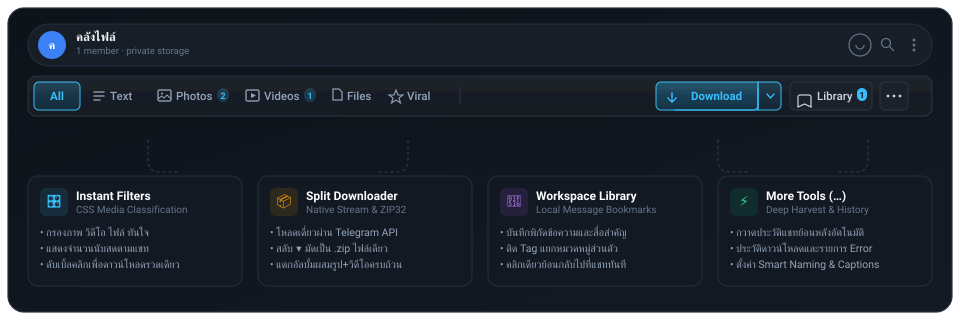

<div align="center">

# ⚡ Telefilter Desktop <sub>v5.0.0</sub>

**Precision Media Intelligence Suite & Batch Downloader for Telegram WebK**

*Ultra-compact Inline Toolbar · Mixed-Album ZIP32 Engine · Local Bookmark Vault*  
*Pure Vanilla JavaScript · Zero Dependencies · 100% Client-Side Privacy*

[](https://greasyfork.org/th/scripts/596222-telefilter-desktop-edition-v5)
[](https://raw.githubusercontent.com/Stxyu-p/telefilter-desktop/main/telefilter_desktop.user.js)
[](https://greasyfork.org/th/scripts/596222-telefilter-desktop-edition-v5)
[](https://web.telegram.org/k/)
[](LICENSE)


</div>

---

## 🧭 Visual Interface Map

The ultra-compact **Inline Toolbar** sits seamlessly beneath the active chat header (34px height). Disclosures open as non-intrusive floating popovers with zero layout shift or chat occlusion.

<p align="center">
  
</p>

---

## ⚡ Core Capabilities

| Capability | Module | What It Does | Technical Advantage |
| :--- | :---: | :--- | :--- |
| **Instant Media Filters** | 🎛️ | Instantly isolate **Text, Photos, Videos, Files, or Viral** messages in the active chat. | Pure CSS-class filtering with zero DOM reload or network lag. |
| **Mixed-Album ZIP Engine** | 📦 | Unpacks multi-item mixed photo/video albums into an organized, single **.zip archive**. | Built-in ZIP32 compiler; automatically deduplicates shared media keys. |
| **Split Downloader** | 📥 | Dual-mode action button: 1-click native Telegram stream or toggle **▾** for ZIP bundling. | Direct memory stream with zero memory leaks or background bloat. |
| **Deep Harvester** | ⚡ | Automated virtual scroller that traverses historical messages to build a media index. | Bypasses Telegram's Virtual DOM pruning limits for large chats. |
| **Workspace Library** | 🔖 | Save message coordinates, tags, and local notes into an offline searchable index. | Jump directly back to any historical message origin with one click. |
| **Smart Naming & Sidecars** | 📝 | Standardizes filenames `[YYYY-MM-DD_HHMM]_[Chat]_[Filename]` and exports sidecar `.txt` captions. | Prevents filename collisions and preserves message context. |
| **MediaViewer Overlay** | 👁️ | Injects instant save and bookmark actions directly inside fullscreen media previews. | Quick-save photos and videos directly from fullscreen previews. |
| **Deduplication Vault** | 🗄️ | Local IndexedDB transaction ledger tracking previously downloaded media hashes. | Prevents redundant downloads and saves local disk storage. |

---

## 🎯 Quick Workflow

### 1. Filter & Isolate
Click any media pill (**Photos**, **Videos**, **Files**) on the toolbar:
- Irrelevant chat bubbles are instantly hidden via CSS.
- Badge counters display real-time media counts in the current view.
- **Pro-tip:** Double-click any filter pill to batch-select all items in that category.

### 2. Choose Download Mode
- **Direct Stream:** Select messages and click `Download` for standard browser download handling.
- **ZIP Archive:** Click the **`▾`** split arrow and toggle `Bundle as ZIP`. The button changes to `ZIP Download` and compresses all selected media into one organized archive.

### 3. Bookmark & Harvest
- Click **`Library`** to view saved message pins, search custom tags, or jump directly to chat coordinates.
- Click **`…`** to launch the automated Deep Harvester or configure custom naming rules.

---

## 🔬 Under the Hood: Mixed-Album ZIP32 & Privacy Invariants

### 1. In-Memory Streaming ZIP32 Compiler
Telegram WebK presents complex challenges when handling mixed-media albums (interleaved photos and videos). Rather than using external bulky libraries (like JSZip), Telefilter Desktop embeds an ultra-optimized native ZIP32 compiler:
- **Bitwise CRC32 Generator:** Pre-computed 256-entry lookup table (`0xEDB88320` polynomial), computed in a single pass over each entry.
- **Zero-Allocation Memory Streams:** Constructs binary ZIP Local Headers, Central Directory Records, and End of Central Directory (EOCD) structures directly using native `Uint8Array` byte operations.
- **Strict Garbage Isolation:** Releases temporary blob memory immediately after disk handoff, preventing memory leaks during large album downloads.

### 2. Resource Footprint

| Metric | Specification | Practical Outcome |
| :--- | :--- | :--- |
| **ZIP Encoding Mode** | Stored (no deflate) + single-pass CRC32 | Media is already compressed — no redundant CPU cost |
| **Filter Application** | CSS class toggles only, no DOM rebuild | Chat never re-renders while filtering |
| **External Dependencies** | **0** (Pure ES2022 JavaScript) | Zero supply-chain attack vectors |
| **Telemetry & Outbound Calls** | **0** — the only network call fetches the Telegram media itself | Complete session and token privacy |

---

## 🛠️ Design & Engineering Principles

| Principle | Specification |
| :--- | :--- |
| **Zero Dependencies** | 100% pure vanilla ES2022 JavaScript. No jQuery, React, or external CDN dependencies. |
| **Solid Neutral Surface** | High-taste dark palette (`#131922`), hairline borders (`1px solid #2b3543`), and dual-layer shadows. |
| **Strict Baseline Rhythm** | Standardized 28px button heights and a low-profile 34px toolbar to maximize chat viewport space. |
| **Floating Popovers** | Sub-menus render out-of-flow as absolute popovers with click-outside auto-dismissal. |
| **100% Local Privacy** | In-memory compression and IndexedDB transactions stay strictly local within the user's browser sandbox. |

---

## 🚀 Installation & Distribution

### Option A: Install via Greasy Fork (Fastest · Auto-Updating)
1. Ensure you have [Tampermonkey](https://www.tampermonkey.net/) installed in your browser (Brave, Chrome, Firefox, or Edge).
2. Click to install directly from Greasy Fork:  
   👉 **[Install from Greasy Fork (v5.0.0)](https://greasyfork.org/th/scripts/596222-telefilter-desktop-edition-v5)**
3. Tampermonkey will prompt you to confirm. Click **Install**.
4. *(Bonus)* Automatically receive future version updates directly within Tampermonkey!

### Option B: One-Click Direct Install (GitHub RAW)
1. Click the GitHub raw distribution link:  
   👉 **[Install via GitHub RAW](https://raw.githubusercontent.com/Stxyu-p/telefilter-desktop/main/telefilter_desktop.user.js)**
2. Tampermonkey will open its installation dialog. Click **Install**.

### Option C: Manual Setup
1. Copy the source code from [`telefilter_desktop.user.js`](telefilter_desktop.user.js).
2. Open Tampermonkey Dashboard → click **Add a new script (+)**.
3. Paste the code, press **Ctrl + S** (or **Cmd + S**) to save.
4. Navigate to [Telegram WebK](https://web.telegram.org/k/) to start using Telefilter.

---

## 🧪 Verification & Test Suite

Run the built-in test suite to verify script syntax, regression coverage, and production-WebK DOM integrity:

```bash
# 1. Syntax and lexical validation
node --check telefilter_desktop.user.js

# 2. Engine, ZIP32, and album-unpacking regression tests (15/15)
node --test telefilter_desktop.regression.test.js

# 3. Static + VM smoke suite
node telefilter_desktop.smoke.test.js

# 4. Headless-browser checks on production WebK DOM fixtures (run `npm install` once)
node telefilter_desktop.ui.check.cjs
node telefilter_desktop.webk_layout.test.cjs
node telefilter_desktop.dom.check.cjs
node telefilter_desktop.live.check.cjs   # full shipped script, end-to-end
```

---

## 📄 License

This project is licensed under the **MIT License**. See the [`LICENSE`](LICENSE) file for details.


<div align="center">

**Telefilter Desktop** <sub>v5.0.0</sub> · Maintained with high standards  
*Clean Minimal Precision · High Taste · Zero Slop*

</div>

