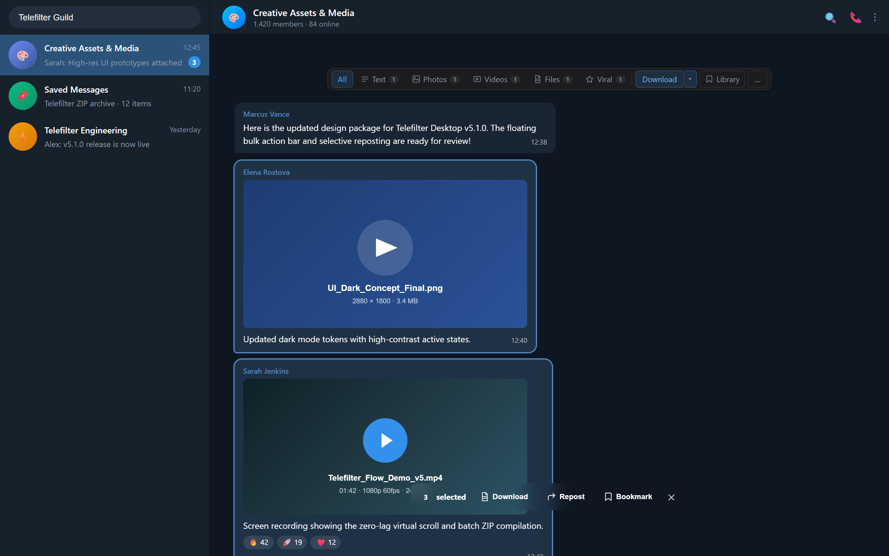
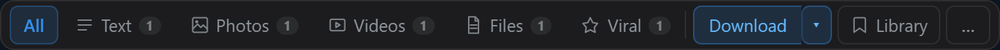
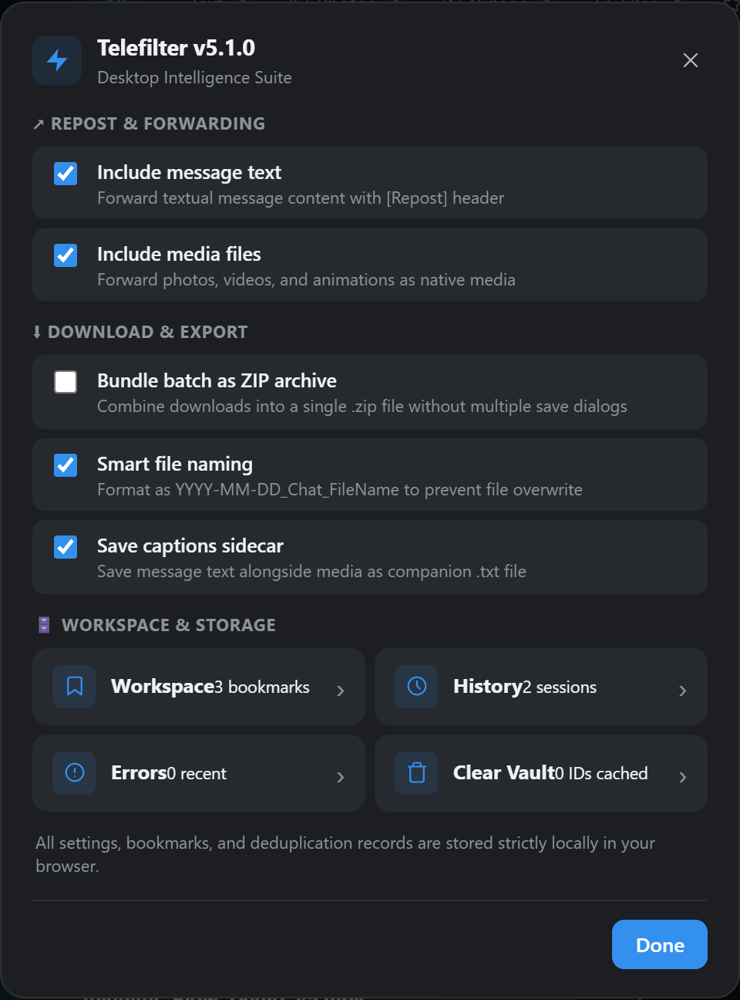
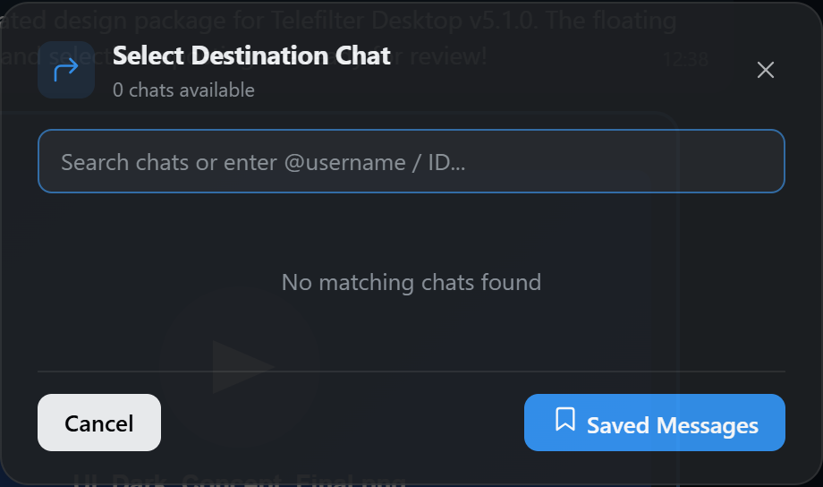
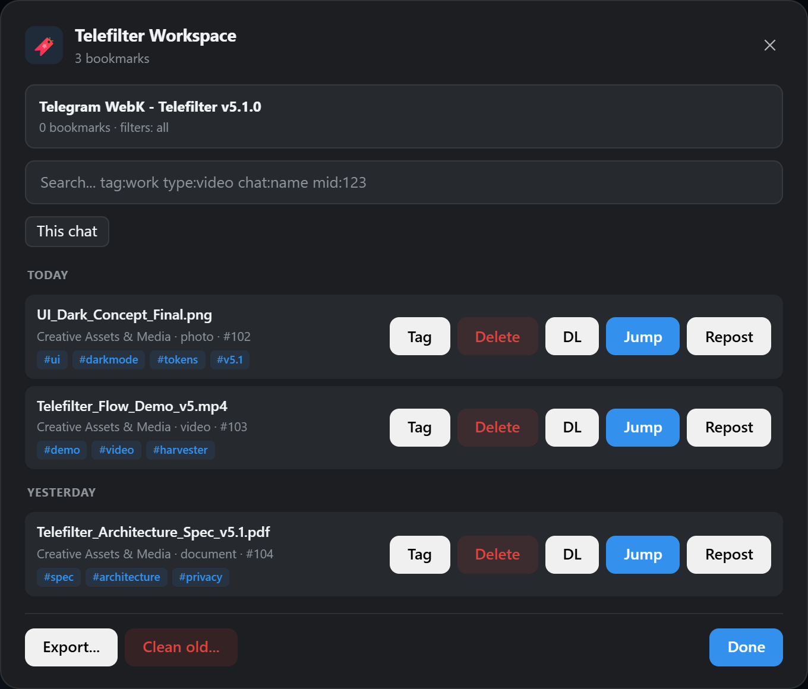
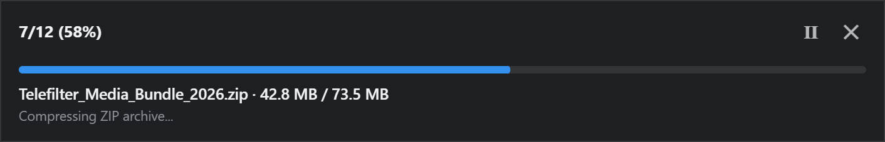

<div align="center">

# ⚡ Telefilter Desktop <sub>v5.2.0</sub>

**Precision Media Intelligence Suite & Batch Downloader for Telegram WebK**

*Ultra-compact Inline Toolbar · Floating Bulk Action Dock · Selective Repost System · Searchable Destination Picker · Mixed-Album ZIP32 Engine*  
*Pure Vanilla JavaScript · Zero Dependencies · 100% Client-Side Privacy*

[](https://greasyfork.org/th/scripts/596222-telefilter-desktop-edition-v5)
[](https://openuserjs.org/scripts/Chokechai/Telefilter_Desktop_Edition_v5)
[](https://raw.githubusercontent.com/Stxyu-p/telefilter-desktop/main/telefilter_desktop.user.js)
[](https://greasyfork.org/th/scripts/596222-telefilter-desktop-edition-v5)
[](https://web.telegram.org/k/)
[](LICENSE)


<br/>

<p align="center">
  
</p>

</div>

---

## 🧭 Visual Interface & Panel Tour

Telefilter Desktop integrates directly into [Telegram WebK](https://web.telegram.org/k/) with zero DOM layout shift, maintaining Telegram's native message rendering while adding precision media intelligence.

### 1. Ultra-Compact Inline Media Toolbar
The 34px inline toolbar docks directly underneath the active chat topbar. Filter pills toggle instantaneously via pure CSS classes, updating live counts for visible messages.

<p align="center">
  
</p>

- **Instant Category Isolation:** `All`, `Text`, `Photos`, `Videos`, `Files`, and `Viral` (scrubs messages by emoji reaction counts).
- **Split Downloader:** Click `Download` for direct native streams, or click `▾` to toggle `Bundle as ZIP` archive mode.
- **Fast Disclosures:** Popover sub-menus open out-of-flow without expanding the chat header or obscuring messages.

---

### 2. Floating Bulk Action Dock (MaxPland Style)
When multiple messages are selected, an ergonomic floating action dock appears at the bottom center of the active chat.

<p align="center">
  
</p>

- **Zero Right-Click Clutter:** No need to navigate nested browser context menus.
- **One-Click Batch Actions:** `Download` selected items, `Repost` to other chats or Saved Messages, or `Bookmark` into your local vault.
- **Selection Count Badge:** Displays the real-time count of selected messages across the viewport.

---

### 3. Modular Settings & Selective Reposting
Access advanced configuration anytime via the toolbar's `…` menu. Everything is organized into clear functional cards.

<p align="center">
  
</p>

- **↗ Repost & Forwarding Configuration:** Choose what to forward—enable or disable message text and media files independently.
- **⬇ Download & Export:** Toggle single-click ZIP bundling, standardized smart file naming, and `.txt` sidecar captions.
- **🗄️ Workspace & Storage:** Quick access to the Bookmark Library, Session History, Error Diagnostics, and IndexedDB Vault deduplication cache.

---

### 4. Searchable Destination Chat Picker
Alt-click `Repost` (or hold Alt and click the bulk bar repost button) to open the in-app destination picker — no browser prompts, no guessing.

<p align="center">
  
</p>

- **Searches up to 100 chats** from Telegram's in-memory dialog storage — shows chats beyond the visible list.
- **Type to filter** by name, or enter `@username` / a numeric peer ID to send to any chat directly.
- **Keyboard navigable:** Arrow keys + Enter to select; Escape to cancel.
- **Saved Messages shortcut** always available at the bottom for quick personal saves.

---

### 5. Telefilter Workspace Library & Message Locator
An offline-first personal catalog of bookmarked messages and assets, stored strictly inside your browser.

<p align="center">
  
</p>

- **Full-Fidelity Jump Locator:** 1-click jumps directly back to the original message in chat history, scrolling and flashing the target bubble.
- **Advanced Search Syntax:** Filter by `tag:design`, `type:photo`, `chat:name`, or message ID.
- **Tag Management & Data Export:** Add custom tags to bookmarks or export your library as structured JSON.

---

### 6. In-Memory Streaming ZIP32 Engine & Live Progress
When downloading albums or batches as a `.zip` archive, Telefilter compiles media in-memory using a pure client-side binary generator.

<p align="center">
  
</p>

- **Zero External Dependencies:** Built-in Bitwise CRC32 lookup table and direct `Uint8Array` binary headers—no JSZip or external CDNs required.
- **Real-Time Progress:** View completed items, total payload size, compression progress, and pause/cancel controls.
- **Deduplication Ledger:** IndexedDB Vault remembers previously downloaded file hashes to prevent redundant downloads.

---

## ⚡ Core Capabilities Matrix

| Capability | Module | What It Does | Technical Advantage |
| :--- | :---: | :--- | :--- |
| **Instant Media Filters** | 🎛️ | Instantly isolate **Text, Photos, Videos, Files, or Viral** messages in the active chat. | Pure CSS-class filtering with zero DOM reload or network lag. |
| **Floating Bulk Dock** | ⚓ | Ergonomic bottom dock for batch actions upon selecting chat messages. | Eliminates context menu interference; zero event hijacking. |
| **Destination Chat Picker** | 🔍 | Searchable in-app modal listing up to 100 chats; supports @username and peer ID entry. | Queries Telegram's in-memory dialog storage — shows all chats, not just visible ones. |
| **Selective Repost** | ↗️ | Configurable repost engine: forward text only, media only, or both. | Respects user preferences in settings; native Telegram bridge. |
| **Mixed-Album ZIP Engine** | 📦 | Compiles multi-item mixed photo/video albums into an organized **.zip archive**. | Built-in ZIP32 compiler; unpacks grouped albums automatically. |
| **Split Downloader** | 📥 | Dual-mode action button: 1-click native Telegram stream or toggle **▾** for ZIP bundling. | Direct memory stream with zero memory leaks or background bloat. |
| **Deep Harvester** | ⚡ | Automated virtual scroller that traverses historical messages to build a media index. | Bypasses Telegram's Virtual DOM pruning limits for large chats. |
| **Workspace Library** | 🔖 | Save message coordinates, tags, and local notes into an offline searchable index. | Jump directly back to any historical message origin with one click. |
| **Smart Naming & Sidecars** | 📝 | Standardizes filenames `[YYYY-MM-DD_HHMM]_[Chat]_[Filename]` and exports sidecar `.txt` captions. | Prevents filename collisions and preserves message context. |
| **MediaViewer Overlay** | 👁️ | Injects instant save and bookmark actions directly inside fullscreen media previews. | Quick-save photos and videos directly from fullscreen previews. |
| **Deduplication Vault** | 🗄️ | Local IndexedDB transaction ledger tracking previously downloaded media hashes. | Prevents redundant downloads and saves local disk storage. |

---

## 🔬 Under the Hood & Privacy Invariants

### 1. Zero-Allocation Binary ZIP32 Compiler
Telegram WebK presents challenges when handling mixed-media albums (interleaved photos and videos). Rather than relying on heavy third-party libraries, Telefilter Desktop embeds a native ZIP32 compiler:
- **Bitwise CRC32 Table:** Pre-computed 256-entry lookup table (`0xEDB88320` polynomial), calculated in a single pass over each media stream.
- **Binary Array Structs:** Constructs binary ZIP Local Headers, Central Directory Records, and End of Central Directory (EOCD) directly via `Uint8Array`.
- **Immediate Memory Reclamation:** Releases temporary blob memory immediately upon browser disk handoff, preventing memory leaks during large downloads.

### 2. Privacy & Resource Footprint

| Metric | Specification | Practical Outcome |
| :--- | :--- | :--- |
| **ZIP Encoding Mode** | Stored (no deflate) + single-pass CRC32 | Media is already compressed — no redundant CPU consumption |
| **Filter Performance** | CSS class toggles only, no DOM rebuild | Zero layout shifts; chat never re-renders while filtering |
| **External Dependencies** | **0** (Pure ES2022 JavaScript) | Zero supply-chain attack vectors |
| **Network Privacy** | **0** telemetry or outbound calls | All network activity stays strictly between your browser and Telegram |
| **Local Storage** | Browser-isolated IndexedDB + localStorage | Bookmarks and settings never leave your personal computer |

---

## 🚀 Installation & Setup

### Option A: Greasy Fork (Recommended · Auto-Updating)
1. Install [Tampermonkey](https://www.tampermonkey.net/) (or Violentmonkey) in your browser.
2. Click to install directly:  
   👉 **[Install from Greasy Fork (v5.2.0)](https://greasyfork.org/th/scripts/596222-telefilter-desktop-edition-v5)**
3. Tampermonkey will prompt you to confirm. Click **Install**.
4. Navigate to [Telegram WebK](https://web.telegram.org/k/) to start using Telefilter.

### Option B: OpenUserJS
1. Install [Tampermonkey](https://www.tampermonkey.net/) (or Violentmonkey) in your browser.
2. Click to install directly:  
   👉 **[Install from OpenUserJS](https://openuserjs.org/scripts/Chokechai/Telefilter_Desktop_Edition_v5)**
3. Confirm the installation in Tampermonkey.

### Option C: One-Click Direct Install (GitHub RAW)
1. Click the raw distribution link:  
   👉 **[Install via GitHub RAW](https://raw.githubusercontent.com/Stxyu-p/telefilter-desktop/main/telefilter_desktop.user.js)**
2. Confirm the installation in Tampermonkey.

### Option D: Manual Setup
1. Copy the source code from [`telefilter_desktop.user.js`](telefilter_desktop.user.js).
2. In Tampermonkey Dashboard, click **Add a new script (+)**.
3. Paste the code and save (**Ctrl + S** / **Cmd + S**).

---

## 🧪 Verification & Automated Testing Suite

The repository includes comprehensive unit, regression, DOM fixture, and headless browser tests:

```bash
# 1. Complete test suite (Node syntax check, 20 regression tests, static contract smoke test)
npm test

# 2. Headless Chromium browser layout & DOM tests across 8 viewport configurations
npm run test:browser

# 3. Regenerate all real UI panel screenshots in assets/
npm run capture:panels
```

---

## 📄 License

This project is licensed under the **MIT License**. See the [`LICENSE`](LICENSE) file for details.

<div align="center">

**Telefilter Desktop** <sub>v5.2.0</sub> · Built for Precision & Reliability  
*Clean Minimal Precision · High Taste · Zero Slop*

</div>
